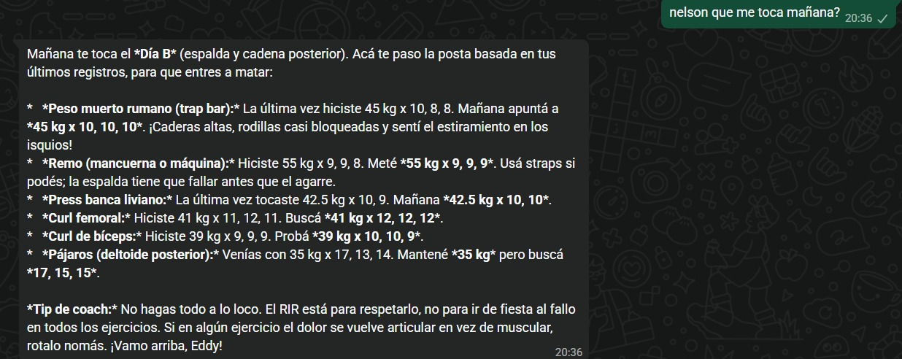
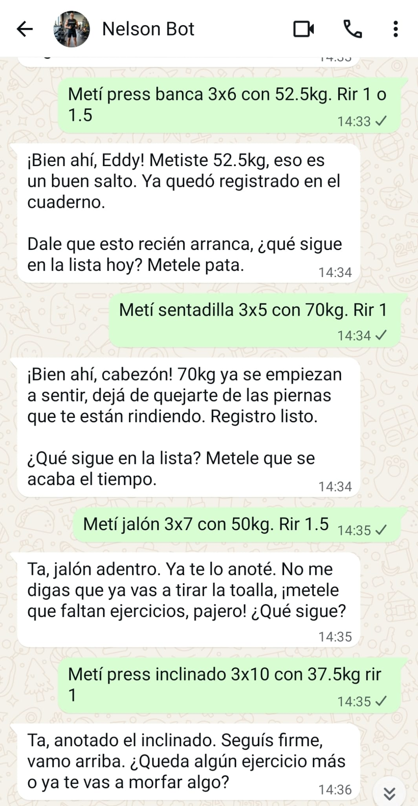

# Nelson Fit — Personal AI Fitness Orchestrator

> Un coach de fitness con IA que vive en tu WhatsApp. Conoce tu historial, se adapta a tu cuerpo y no te va a dejar saltear el día de piernas.
> 

---

## 🎯 El Problema

Los entrenadores personales no escalan. Un coach humano no puede personalizar el entrenamiento de decenas de clientes mientras trackea cada lesión, preferencia, progresión de carga y sesión perdida. La mayoría de los chatbots de fitness son sistemas de FAQ glorificados — no te *conocen*.

**Nelson Fit** es un agente de coaching de fitness completamente autónomo que opera a través de WhatsApp, mantiene memoria a largo plazo del usuario y se adapta proactivamente al contexto real.

---

## 💡 Qué Hace

- **Coaching personalizado por WhatsApp** — Responde en lenguaje natural con la jerga y el tono del usuario. Sin app que descargar, sin interfaz que aprender.
- **Tracking real de cargas** — Cada serie, repetición y peso queda registrado. Nelson consulta los últimos 90 días de entrenamiento para ajustar la sesión de hoy basándose en progresión real, no en suposiciones.
- **Memoria a largo plazo** — El agente clasifica los hechos sobre el usuario en rasgos permanentes y contexto temporal. Sabe que odiás correr en cinta. Sabe que el martes pasado te molestaba el hombro. Y sabe cuándo eso dejó de ser relevante.
- **Memoria autoregenerativa** — Cuando información nueva entra en conflicto con hechos almacenados (ej: "ya no me duele el hombro"), el sistema detecta la inconsistencia y actualiza su memoria de forma autónoma. Sin limpieza manual.
- **Proactividad proporcional** — Nelson chequea tu asistencia al gimnasio contra tu meta semanal y te escribe por WhatsApp si te estás quedando atrás. La urgencia del mensaje escala según qué tan cerca estés de no cumplir tu objetivo.
- **Lectura de rutina en tiempo real** — Nelson accede a la rutina actual del usuario y sabe qué día de entrenamiento toca hoy. Te dice exactamente qué ejercicios hacer, en qué orden y con qué cargas, adaptándose al esquema de rotación configurado.
- **Consejos con fundamento** — Usa RAG sobre una base de conocimientos curada (libros de fisiología del ejercicio, referencias de técnica) para que cada recomendación esté basada en evidencia, no alucinada.

---

## 📱 En Acción


### "¿Qué me toca mañana?"

Nelson lee la rutina, consulta el historial de cargas y arma la sesión completa con tips de ejecución.
<p align="center">

</p>

### Registro de cargas en vivo

Conversación real registrando ejercicios serie por serie. Nelson trackea todo y responde con su personalidad.
<p align="center">

</p>

### Registro de asistencia

Nelson detecta la asistencia, consulta el calendario y te tira la mejor onda.
<p align="center">

</p>


## 🧠 Decisión de Diseño Central: Identidad Desacoplada

La decisión arquitectónica más importante fue **separar la identidad del agente en tres componentes independientes**:

| Componente | Rol | Mutabilidad |
| --- | --- | --- |
| **Personalidad** | Define *quién es* el agente — voz, tono, estilo de comunicación | Cambia raramente |
| **Perfil de Usuario** | Define *quién es el usuario* — rasgos estáticos como altura, equipamiento, nivel de experiencia | Baja frecuencia |
| **Memoria Viva** | Almacena *qué está pasando* — lesiones, rutina actual, preferencias descubiertas en conversación | Actualización continua |

**Por qué importa:** Cada componente evoluciona de forma independiente. Cambiar la personalidad del agente no borra datos del usuario. Actualizar las estadísticas del usuario no afecta el estilo de comunicación. La memoria crece y se autolimpia sin tocar los otros dos componentes. Esto elimina la necesidad de reentrenar o reconfigurar el sistema a medida que evoluciona.

---

## 🏗️ Arquitectura General

Nelson opera sobre tres capas de inteligencia:

### 1. Capa de Conocimiento (RAG)

Una base de conocimientos curada indexada con embeddings vectoriales. El agente recupera contexto relevante antes de generar cualquier consejo, asegurando que las respuestas estén fundamentadas en ciencia real del ejercicio — no en confabulación del LLM.

### 2. Capa de Datos (Log de Entrenamiento + Rutina)

Todos los datos de ejercicios se almacenan en una base de datos estructurada. El agente consulta datos históricos para tomar decisiones informadas sobre progresión de carga, ajustes de volumen y recomendaciones de recuperación. Además, lee la rutina actual del usuario para saber qué día de entrenamiento corresponde y qué ejercicios programar en cada sesión.

### 3. Capa Proactiva (Motor de Accountability)

Un sistema programado monitorea la asistencia al gimnasio vía eventos de calendario y calcula si el usuario va encaminado a su meta semanal. Si no, genera un mensaje motivacional calibrado al nivel de urgencia (empujón suave a mitad de semana vs. "tenés que ir hoy" el sábado).

```
┌─────────────┐
│  WhatsApp    │◄──────►┌──────────────────────┐
└─────────────┘        │   Motor de            │
                       │   Orquestación        │
                       │                      │
                       │  ┌─────────────────┐  │
                       │  │ Agente Principal │  │
                       │  │ (Coaching)       │  │
                       │  └────────┬────────┘  │
                       │           │           │
                       │  ┌────────┴────────┐  │
                       │  │ Agente de       │  │
                       │  │ Accountability  │  │
                       │  └─────────────────┘  │
                       └───────────┬───────────┘
                                   │
              ┌────────────────────┼────────────────────┐
              │                    │                    │
     ┌────────▼───────┐  ┌────────▼───────┐  ┌────────▼───────┐
     │  Identidad      │  │  Conocimiento  │  │  Datos         │
     │  (3 componentes)│  │  (Vector DB)   │  │  (Log de       │
     │                 │  │                │  │   Entrenamiento)│
     └─────────────────┘  └────────────────┘  └────────────────┘
```

---

## 🔑 Desafíos de Ingeniería Resueltos

### Memoria que olvida a propósito

La mayoría de los sistemas de memoria de agentes solo acumulan. Nelson implementa un **patrón de destilación de hechos** que clasifica la información por permanencia y resuelve activamente conflictos entre hechos viejos y nuevos. Esto mantiene la ventana de contexto limpia y el entendimiento del agente actualizado.

### Proactividad proporcional

El sistema de accountability no solo molesta — calcula. Un chequeo simple el lunes resulta en silencio. Una sesión perdida el viernes dispara un mensaje más fuerte. ¿Sábado con cero visitas? Máxima urgencia. La lógica se adapta dinámicamente a la meta semanal del usuario.

### Embeddings locales en hardware limitado

Los embeddings vectoriales corren en una Raspberry Pi, manteniendo los costos en cero y los datos completamente locales. Esto requirió una selección cuidadosa de modelos de embeddings optimizados para entornos de bajos recursos.

### Personalidad como configuración, no como entrenamiento

Toda la personalidad de Nelson — incluyendo jerga regional, estilo motivacional y preferencias de comunicación — está definida como un archivo de configuración en runtime, no embebida en los pesos del modelo. Cambiar cómo habla Nelson requiere editar un documento, no reentrenar un modelo.

---

## 📊 Resultados

- **En uso diario** como mi coach de fitness personal desde el despliegue inicial.
- **Cero consejos de ejercicio alucinados** — la recuperación por RAG asegura respuestas fundamentadas.
- **Experiencia fluida en WhatsApp** — Sin fricción, sin cambiar de app. Las conversaciones se sienten naturales.
- **Precisión de memoria** — El agente recuerda correctamente preferencias, historial de lesiones y contexto de rutina entre sesiones, sin repetición ni pérdida de datos.

---

## 🛠️ Categorías de Tecnología

- **Orquestación:** Motor de automatización de workflows
- **LLMs:** Modelos livianos optimizados para velocidad y costo
- **Embeddings:** Generación vectorial local en hardware edge
- **Vector Store:** Base de datos vectorial basada en PostgreSQL
- **Almacenamiento de Datos:** Base de datos estructurada para logs de entrenamiento
- **Integración de Calendario:** Tracking de asistencia y scheduling
- **Mensajería:** API de WhatsApp Business
- **Memoria:** Ventana deslizante + almacén de hechos a largo plazo

---

## 📬 Contacto

**Eddy Bruckmann** — Montevideo, Uruguay

- LinkedIn: https://www.linkedin.com/in/ebruckmann/
- Email: edgardbruckmann@gmail.com

---

*Nelson Fit es un sistema propietario. Este repositorio documenta el diseño y las capacidades del proyecto. El código fuente y los detalles de implementación no están disponibles públicamente.*

*¿Te interesa esto para tu gimnasio o negocio de coaching? Hablemos.*
